# Flashcards App — User Guide

This guide covers installing, running, and using Flashcards day to day. For an
overview of what the app can do, see the main [README](../README.md); for how it's
built internally, see [Developer guide](./Developer.md).

---

## Table of contents

1. [Getting started](#1-getting-started)
2. [Flashcard sets](#2-flashcard-sets)
3. [Viewing and editing cards](#3-viewing-and-editing-cards)
4. [Writing card content in Markdown](#4-writing-card-content-in-markdown)
5. [Reviewing a set](#5-reviewing-a-set)
6. [Changing the language](#6-changing-the-language)
7. [Keyboard shortcuts](#7-keyboard-shortcuts)
8. [Where your data is stored](#8-where-your-data-is-stored)
9. [Known issues](#9-known-issues)

---

## 1. Getting started

Flashcards is a Windows desktop app, so it only runs on Windows (10 or 11) — not on
macOS or Linux. You don't need Visual Studio or any programming tools to run it; the
steps below don't involve a command line.

### Step 1: Get the app running

There are three ways to get it running, depending on what you have available. Pick one.

**Option 1 — Open it in Visual Studio.** Open `Flashcards.sln` and press Start/F5.
Nothing else to do — the app is already running, so skip straight to
[Step 2](#step-2-launch-the-app).

**Option 2 — Use the pre-built version.** In the repository root, open the
**`publish`** folder. It contains two `.zip` files:

| Your PC | Download |
|---|---|
| Most Windows PCs | [win-x64.zip](./publish/win-x64.zip) |
| ARM-based Windows PCs (some newer Surface devices, "Copilot+ PCs") | [win-arm64.zip](./publish/win-arm64.zip) |

If you're not sure which you have, use win-x64. Download the matching zip and extract
it to a folder of your choice — it's self-contained, so that's everything: no install
step, no .NET runtime to download.

**Option 3 — Build a standalone copy yourself.** Right-click **Flashcards.App** in
Solution Explorer and choose **Publish**. Pick the existing profile for your platform
(x64 or ARM64) and click **Publish**. When it finishes, Visual Studio shows the output
folder's path — copy everything in that folder (not just the `.exe`) to wherever you
want to run it from.

### Step 2: Launch the app

Open the folder from whichever option you used above, and double-click
`Flashcards.App.exe`.

The first time you launch the app, there are no flashcard sets yet, so you'll land on
an empty starting screen with options to create a new set.

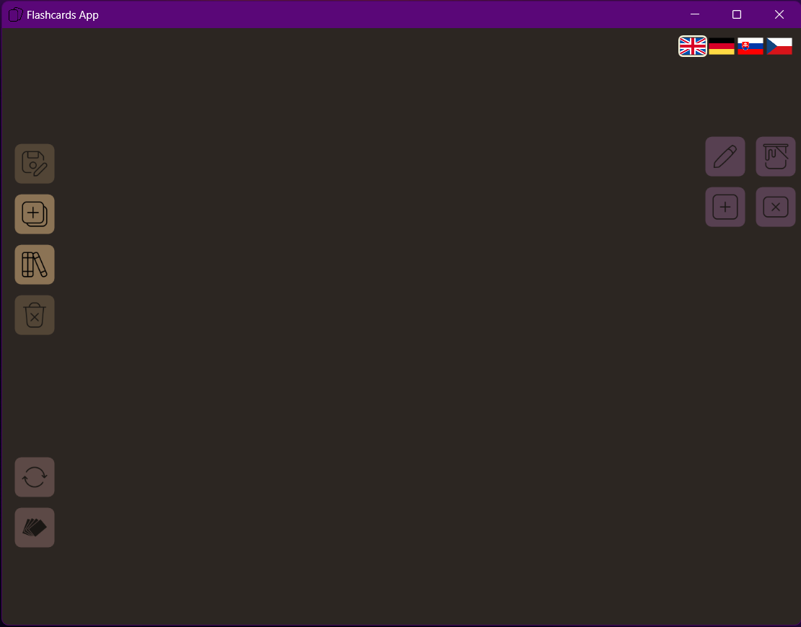

[↑ Back to top](#table-of-contents)

---

## 2. Flashcard sets

A **flashcard set** groups related cards under one name — a subject, a chapter,
whatever you're studying together as one unit.

One button in the top-left toolbar does double duty as both **delete** and **back to the home
screen**, depending on what you're doing when you click it — its icon changes to match:


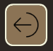

- While a set is actually open (viewing or editing it), it **deletes that set**, after
  asking you to confirm.

- While you're naming a new set, choosing a set to open, or in the middle of a review
  session, the same button instead just **takes you back**, with nothing deleted —
  it cancels the in-progress name/selection, or (during a review) asks whether to save
  your progress first, then returns you to the home screen either way (more on this in
  [§5](#5-reviewing-a-set)).

### 2.1 Creating a set


Click the create-set icon in the top toolbar, then type a name. Confirm either by
pressing **Enter** or by clicking the confirm button.

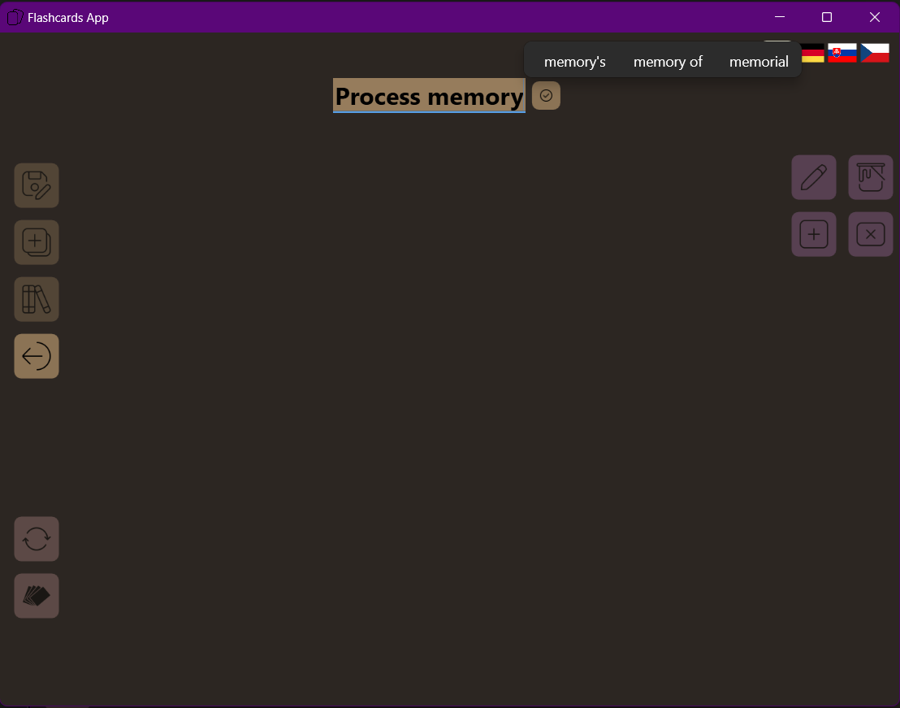

Once you click away, a mark
under the box tells you at a glance whether the name is valid: if the box is empty,
all you'll see is a small dot; otherwise you'll see a full underline, colored
**green** if the name is fine or **red** if it isn't, with a message explaining why
(see below). Either way, clicking into the text area puts you back into the box so you can
keep typing or confirm.


A name can't be empty, and it can't already be used by another set — the app tells you
if either happens and won't let you confirm until it's fixed. This check ignores
letter case, so "Math" and "math" count as the same name and can't both exist as
separate sets.

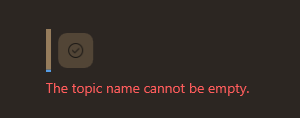

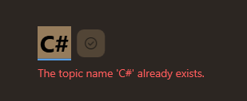

A name can be up to 50 characters. Once you're down to the last 10, a small counter
appears showing exactly how many are left, so you're not left guessing when you'll hit
the limit. Reaching the 5-character threshold, the color changes from orange to red, indicating you may soon run out of characters.

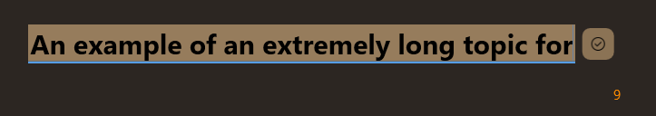

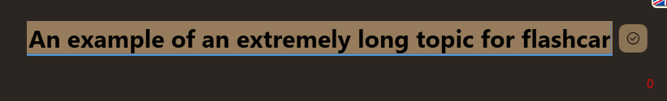

*The same name field, with the exact same rules, is reused when [renaming a set](#35-renaming-a-set).*

### 2.2 Opening a set


Click the open-set icon to see a list of every set you've created so far, along with
how many cards each one has. If the topics can't fit on screen at once, you can scroll through them. Pick one and confirm to open it by **double-click** or **Enter**.

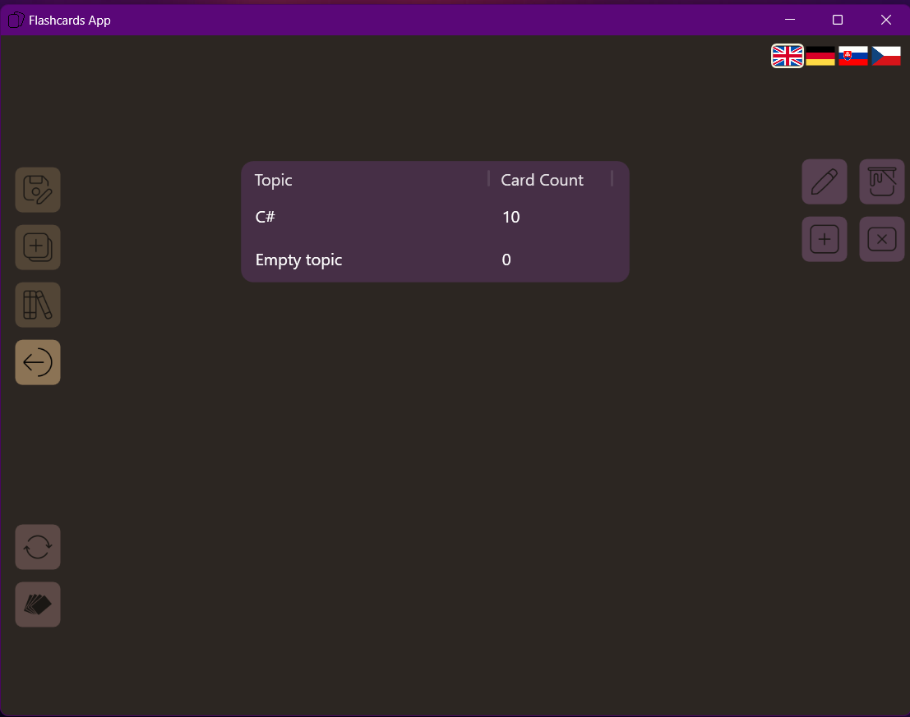

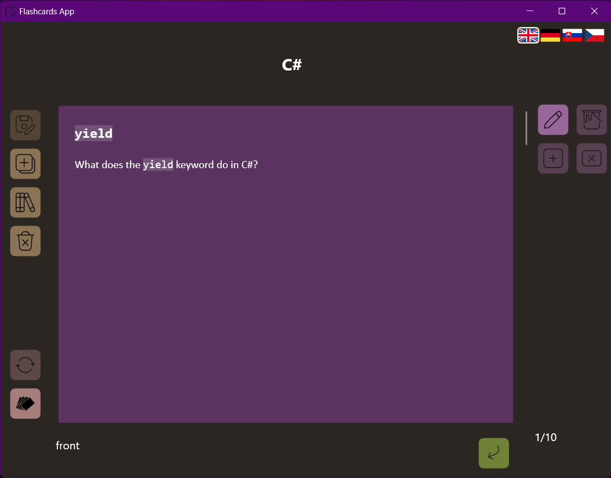

If you haven't created any sets yet, you'll see a message telling you so instead of an
empty list.

### 2.3 Deleting a set


While a set is open, the delete-set icon (see the [shared button](#2-flashcard-sets)
above) removes it — after confirming, since this deletes every card in it
permanently, with no built-in way to get it back afterward.

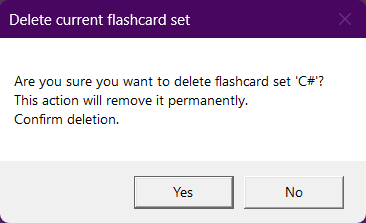

[↑ Back to top](#table-of-contents)

---

## 3. Viewing and editing cards


Opening a set puts you in **view mode**: you can flip through its cards, but not
change them. Click the edit icon to switch to **edit mode**, where you can add, remove,
and change cards. You can return to the view mode by clicking the button once again.

> A white outline around the edit icon means it's turned on — that's your visual cue
> that you're currently in edit mode.


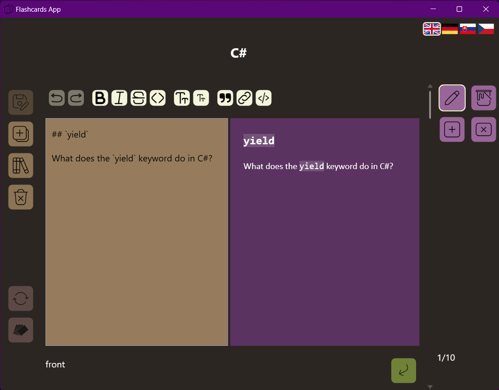

*Note that the formatting panel is only visible once there is at least one card to
edit — a brand-new, empty set shows no card at all until you add one (see
[§3.2](#32-adding-and-deleting-cards)). Similarly, the delete and color buttons are
enabled when it makes sense.*

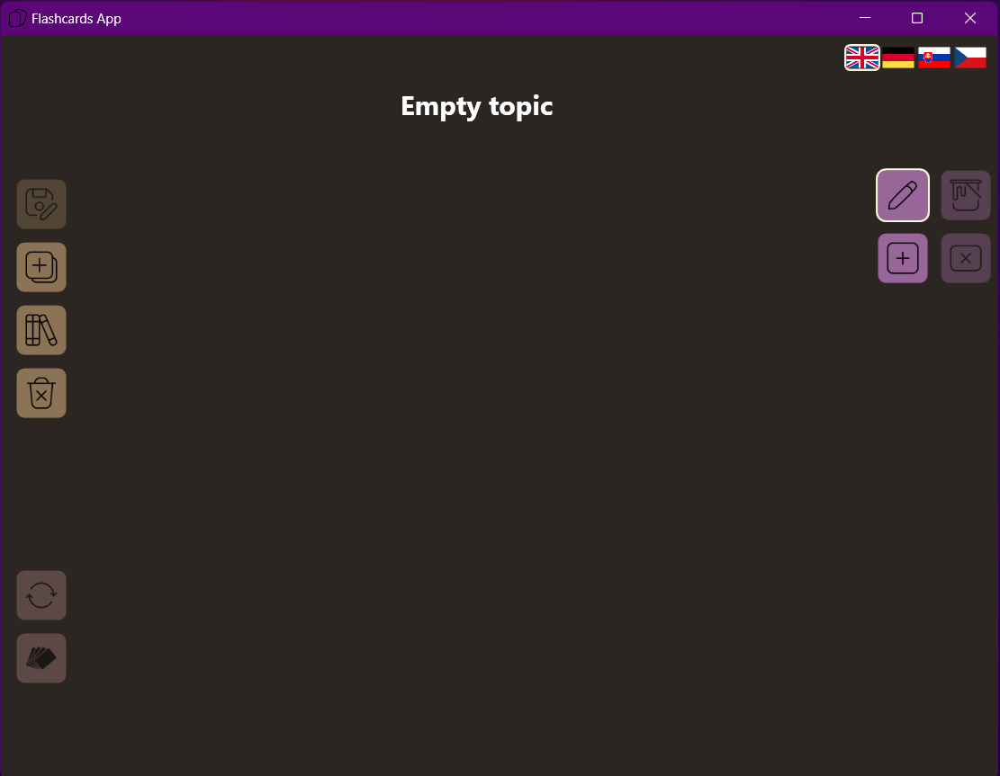

### 3.1 Browsing cards

Move between cards using the arrows built into the **scrollbar** on the right, the
**Up**/**Down** arrow keys, or the **mouse wheel** — as long as your cursor isn't over the card
itself. If it is, scrolling instead scrolls the card's own content, for cards whose
text is too long to fit all at once.

The card number shown on screen updates automatically as
you move, so you always know exactly which one you're on.

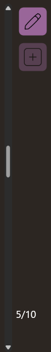

Below the card, a small label tells you whether you're looking at its *front* or its
*back*. Flip between them with the flip button in the bottom right, or by pressing
**Space**. If you flip a card to its back and then move to a different card, that one
opens on its back too — the side you're looking at carries over from card to card,
which makes it easier to check several backs (or fronts) in a row without re-flipping
each one individually.

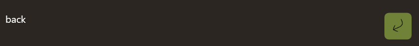

### 3.2 Adding and deleting cards

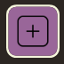
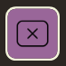

In edit mode, use the add-card icon to insert a new, blank card at the end of the flashcard set. You will be automatically navigated there. The color used for background is the one last selected in color dialog, or the default (see [§3.3](#33-setting-a-cards-color)).

Use the delete-card icon to remove the one you're currently looking at.

### 3.3 Setting a card's color


Each card has its own background color. Click the color icon and pick one from the
color picker. Confirming changes the color of the card preview, on the right — the editor itself, on the left, keeps its own separate background regardless of the card's color, so the two stay visually distinct.

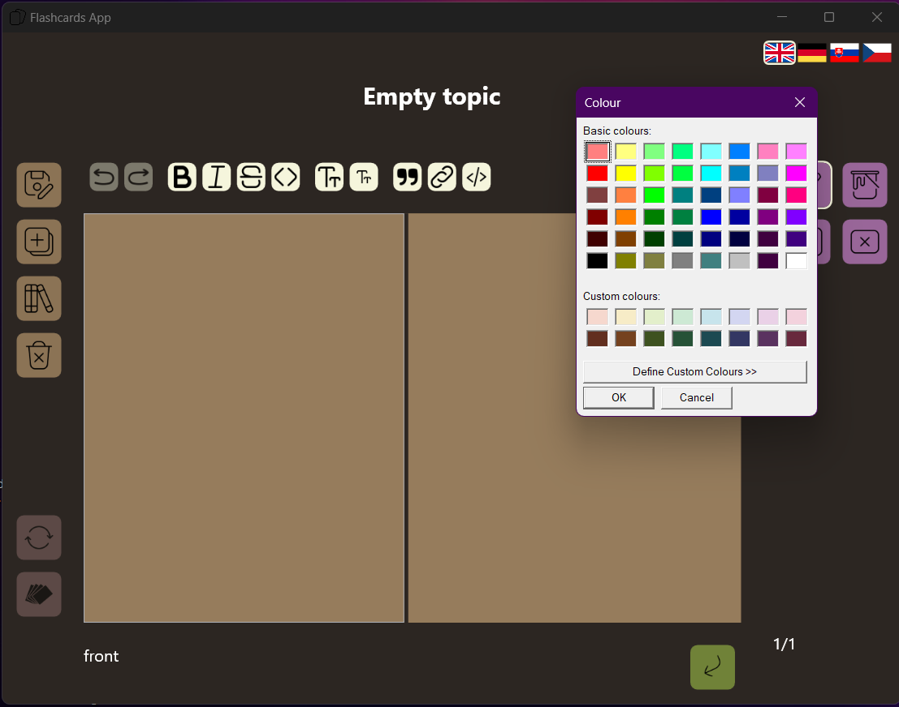

### 3.4 Saving your changes


Nothing is written to disk until you save — click the save icon (or press **Ctrl+S**).
If you try to close, switch, or leave a set with changes still unsaved, you'll be asked
whether to save them first.

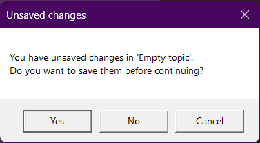

### 3.5 Renaming a set

In edit mode, click the set's name to edit it in place. Everything else works exactly
the same as when creating a set — confirming, the valid/invalid indicator, the
character limit and counter, all of it (see [§2.1](#21-creating-a-set)) — since it's
the same name field and the same rules underneath, just editing an existing name
instead of typing a brand-new one.

[↑ Back to top](#table-of-contents)

---

## 4. Writing card content in Markdown

Each side of a card is written in **Markdown** — plain text with a few simple symbols
that control formatting — and rendered live in a preview pane right next to what
you're typing. If you're unfamiliar with the concept and would like to know more, check out how to write [basic syntax in markdown](https://www.markdownguide.org/basic-syntax/).

The two panes scroll together, so the preview stays lined up with
whatever part of the text you're currently editing. You can scroll either one using
the shared scrollbar's arrows, the mouse wheel (while hovering above the panes), or by **Up**/**Down** arrows while either pane is in focus.

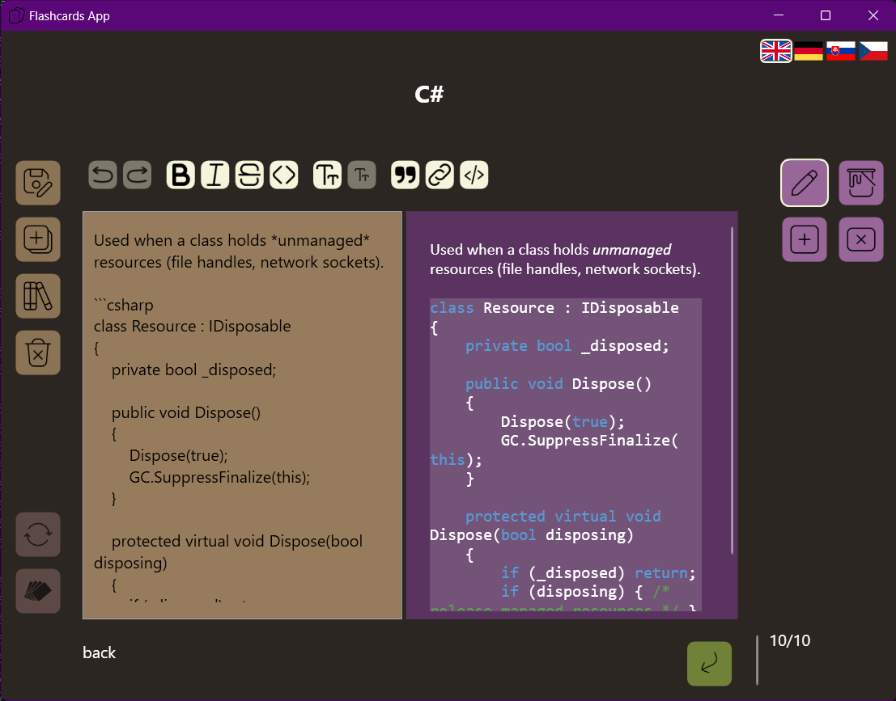

Text in the editor automatically adjusts its color to stay readable against the
card's background — so it stays legible no matter which color you've picked for the
card (see [§3.3](#33-setting-a-cards-color)).

You can type the Markdown syntax directly, or use the formatting toolbar above the
editor, which inserts the right symbols for you at the cursor:


| What it does | Markdown syntax | Toolbar button |
|---|---|---|
| **Bold** | `**text**` |  |
| *Italic* | `*text*` |  |
| ~~Strikethrough~~ | `~~text~~` |  |
| Inline code | `` `code` `` |  |
| Heading (levels 1–6) | `#` through `######` at the start of a line |  Click repeatedly to cycle levels. |
| Quote | `> text` |  |
| Link | `[label](url)` |  |
| Code block | ```` ```code``` ```` |  |

### Bold, italic, strikethrough, inline code


These four buttons are **toggles**. Click into a word (or select some text) and the
button shows whether that word or selection is already bold/italic/struck-through/code —
pressed if it is (signalled by brown button highlighting), not if it isn't. Clicking applies the same rule both ways: with a
selection, it wraps or unwraps exactly that selection; with no selection, it wraps or
unwraps the whole word your cursor is resting in — it doesn't just drop a pair of
markers at the cursor position.

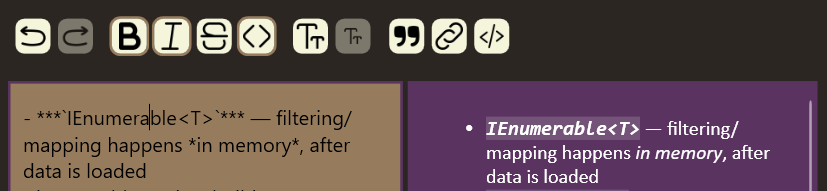

This only recognizes a word that's *directly* wrapped in its own marker pair — e.g.
`*word*`. If your cursor is on a word buried inside a longer formatted phrase (in
`*abc def*`, clicking into `def`), the button won't show it as
active, even though it visually renders as italic in the preview. Detecting that
correctly would mean splitting the surrounding markers around just that one word,
rather than just adding or removing a single pair around it.

### Headings

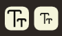

Two buttons change the heading level of whichever line your cursor is on:

- **Upsize** makes the heading bigger — in Markdown, fewer `#` means a bigger heading,
  so this button counts down `######` → `#####` → ... → `#`. From plain text, it jumps
  straight to the smallest heading (`######`).
- **Downsize** does the reverse — counts up from `#` toward `######`, and one more
  click past the smallest heading returns the line to plain text.

Both buttons disable themselves at the end of the range (Upsize once you're at the
biggest heading, Downsize once you're back to plain text), so you can't go further
than the format actually supports.

### Quotes, links, and code


The remaining three buttons insert the relevant Markdown around your selection (or at
the cursor, if nothing is selected): **Quote** for a `>` blockquote, **Link** for
`[label](url)`, and **Code block** for a fenced multi-line code block.
Add a language name right after the opening fence (e.g. ` ```csharp `) to get syntax
highlighting in the preview — if you leave it out, or use a language it doesn't
recognize, the code just shows as plain text instead.

*Rendered links aren't clickable in the preview yet — see [§9](#9-known-issues).*

### Undo and redo

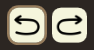

**Ctrl+Z** / **Ctrl+Y** undo and redo your edits, but only within the side of the card
you're currently looking at. Flipping the card, or moving to a different card, starts
a fresh undo history for whatever you're now looking at — so you can't undo back into
changes you made on a different side or a different card.

[↑ Back to top](#table-of-contents)

---

## 5. Reviewing a set

### 5.1 Entering a session
 

 
Click the session icon to begin going through a set's cards for study — this
shuffles the cards and puts you into a **review session**. The button stays disabled
until the set has at least one card (see [§3.2](#32-adding-and-deleting-cards)).
 
> A white outline around the session icon means it's turned on — that's your visual cue
> that you're currently in learning mode.
 
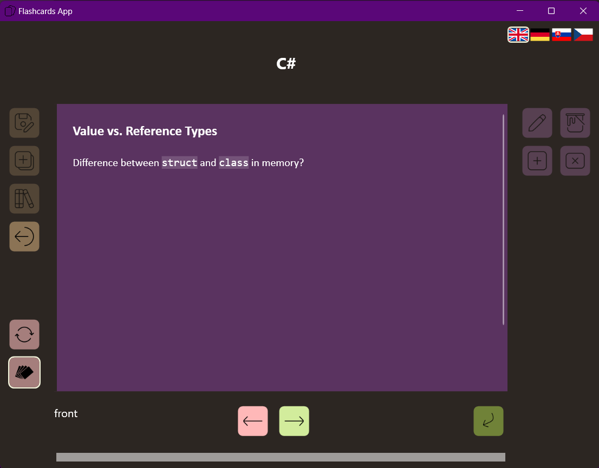
 
### 5.2 During the session
 

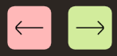
 
- Flip the current card with **Space** or the flip button, to check the answer against
  what you wrote on the other side.
- Mark your answer **incorrect** or **correct** using the on-screen buttons, or the
  **Left**/**Right** arrow keys (see the full list in [§7](#7-keyboard-shortcuts)) —
  this also moves you on to the next card in the session automatically, so there's no
  separate "next card" step during a review.
Cards you mark incorrect come back around sooner than ones you're already getting
right consistently, so the session naturally spends more time on whatever you're still
struggling with — rather than repeating every card the same fixed number of times.
 
### 5.3 Progress and restarting
 
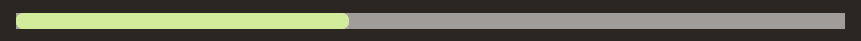
 
The progress bar doesn't track correct answers directly — it fills in as cards get
**fully learned** and drop out of the rotation for good, which can take more than one
correct answer per card. So marking a card correct won't always move the bar; it moves
once that card has been answered well enough, overall, to be considered done.
 
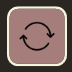
 
The refresh button restarts the whole session from scratch: it reloads the set's cards
straight from the database (discarding any answer progress from the current session
that hasn't been saved yet) and shuffles a brand-new queue.
 
### 5.4 Finishing a session
 
Once every card has been fully learned, the progress bar reaches 100% and briefly
turns green — you'll see a short, empty moment on screen right after, before the app
takes you back to view mode for the set.
 
### 5.5 Leaving early and resuming
 
If you leave a review session before finishing, you'll be asked whether to save your
progress. Saying yes lets you pick up later exactly where you left off, rather than
starting over from a fresh shuffle.
 
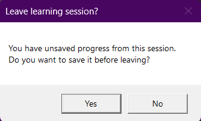
 
Separately, if a saved-but-unfinished session already exists the next time you start a
review on this set, you'll instead be asked whether to **resume** it — accepting
continues that same queue; declining discards it and shuffles a new one.
 
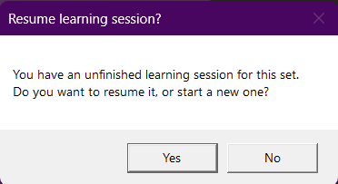
 
[↑ Back to top](#table-of-contents)

---

## 6. Changing the language

The app's language can be switched at any time, from anywhere, without needing to
restart. Click the flag icon for the language you want: English, German, Slovak, or Czech.


It's worth keeping this set to the same language as your Windows display language.
Every caption and message you see comes from the app itself, so it always follows
whatever you pick here — but the confirmation dialogs' **Yes**/**No**/**Cancel**
buttons are drawn by Windows, not by the app, and are labeled in your OS's display
language regardless of this setting. If the two don't match, you'll end up with a
dialog whose message is in one language and whose buttons are in another.

[↑ Back to top](#table-of-contents)

---

## 7. Keyboard shortcuts

| Key | Action |
|---|---|
| Enter | Confirm the set name *(while typing/editing it)*, or open the selected set *(in the set-selection list)* |
| Space | Flip the current card |
| ↑ | Previous card *(viewing/editing a set only)* |
| ↓ | Next card *(viewing/editing a set only)* |
| → | Mark correct *(during a review session)* |
| ← | Mark incorrect *(during a review session)* |
| Ctrl+S | Save changes |
| Ctrl+Z | Undo *(while editing card text)* |
| Ctrl+Y | Redo *(while editing card text)* |

[↑ Back to top](#table-of-contents)

---

## 8. Where your data is stored

Everything — every set and every card — is stored locally in a single [SQLite](https://sqlite.org/) database
file, created automatically the first time you run the app. No account, server, or
internet connection is involved.

The file lives at:

```
%AppData%\FlashcardsDatabase\flashcards.db
```

(that's usually `C:\Users\<you>\AppData\Roaming\FlashcardsDatabase\flashcards.db`).
Back it up like any other file if you want to keep a copy, or delete it to reset the
app back to having no sets at all.

[↑ Back to top](#table-of-contents)

---

## 9. Known issues

- Clicking a link rendered inside a card's Markdown preview doesn't currently open it
  (see [§4](#4-writing-card-content-in-markdown)). Writing and viewing the link text
  works fine — only the click-to-open behavior doesn't yet.

[↑ Back to top](#table-of-contents)